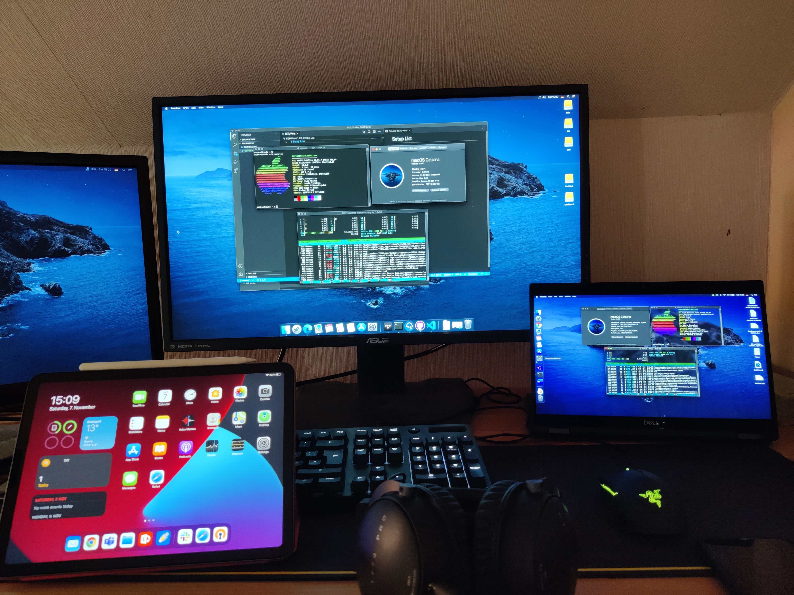

# Setup List

# Hardware

## Desktop PC
### CPU:
- AMD Ryzen 3900x @3,8 GHz

### GPU: 
   + Nvidia GTX 1080ti by Palit
   + AMD Radeon RX560 4G by MSI

### RAM: 
- 32 GB DDR4-2666 HyperX Predator

### Board:
- MSI MEG x570 ACE

### Water Cooler:
- Corsair Hydro Series H100i PRO

### Power Supply:
- 1200 Watt be quiet! Dark Power Pro 11

### M.2:
- 1 TB Corsair MP600 PCIe 4.0

### SSDs:
- 250 GB Samsung 850 EVO
- 500 GB Samsung 850 EVO
- 2TB Samsung EVO 860

### OS:
- Windows 10 Pro 2004 
- macOS 10.15.7 Catalina

 

## Notebook
### Dell Latitude 7389 2-in-1

### CPU:
- Intel Core i5-7200U

### RAM
- 8GB DDR4

### SSD
- M.2 265 GB

## Tablet

**iPad Air Gen. 4 (2020)**